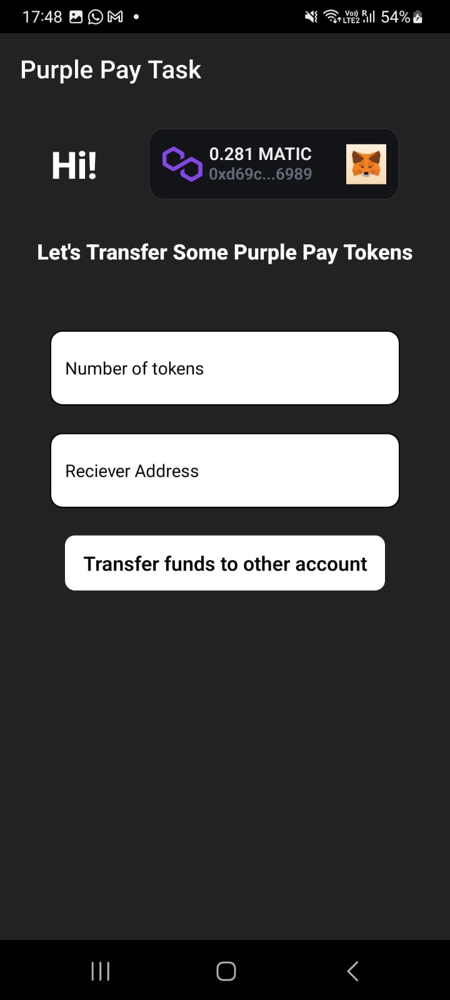
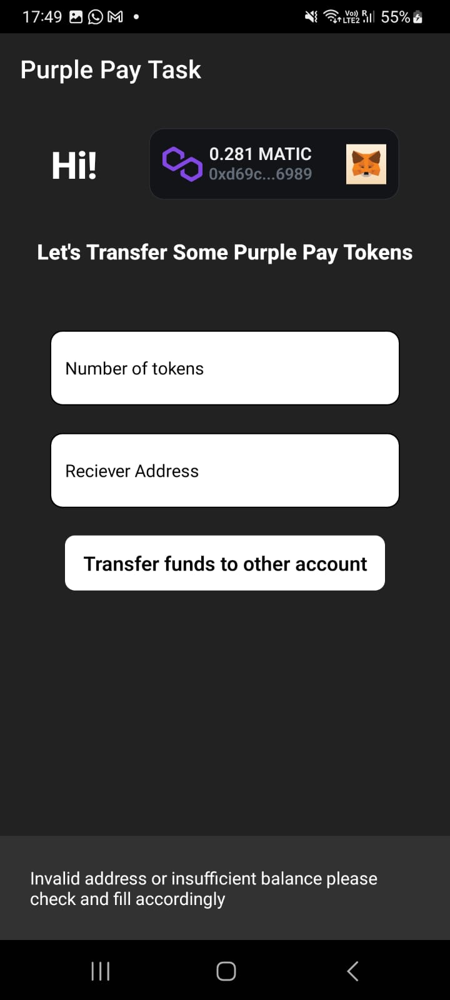
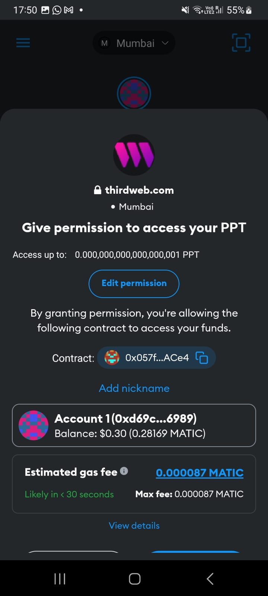
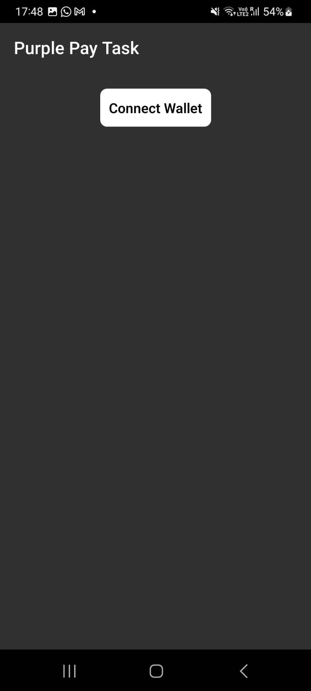
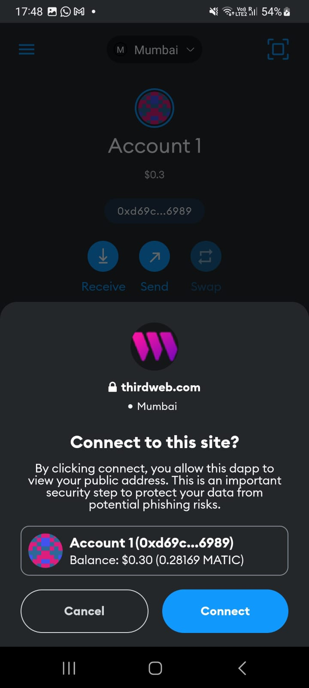
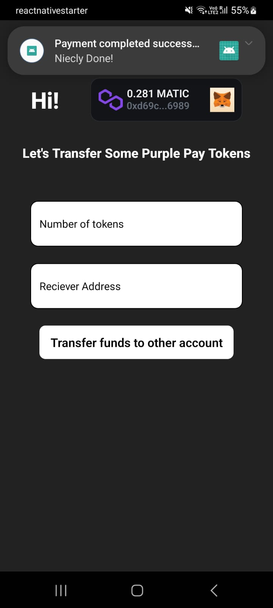
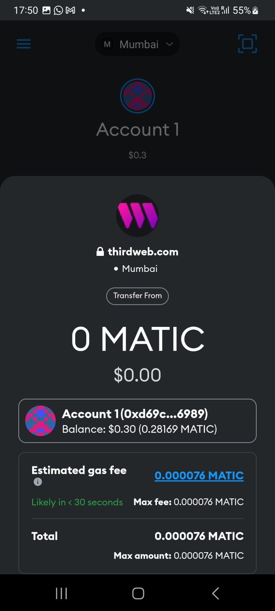

# PurplePay-Task
Task for purple pay. A react native application to transfer ERC20 Tokens from EOA to Smart Contract / EOA to EAO

Token/Base contract : https://mumbai.polygonscan.com/address/0x057fc153A60370453362459Bcc67bE357451ACe4

## Features

- Metamask authentication
- ERC20 token transfer
- local push notification

## Resources Used
- Third Web: https://portal.thirdweb.com/react-native
- Remix, Metamask for deploying simple contract on Polygon Mumbai

## Screenshots
<table>
  <tr>
     <td>Screenshot1</td>
     <td>Screenshot2</td>
     <td>Screenshot3</td>
     <td>Screenshot4</td>
     <td>Screenshot5</td>
     <td>Screenshot6</td>
     <td>Screenshot7</td>
  </tr>
  <tr>
    <td></td>
    <td></td>
    <td></td>
    <td></td>
    <td></td>
    <td></td>
    <td></td>
  </tr>
 </table>
